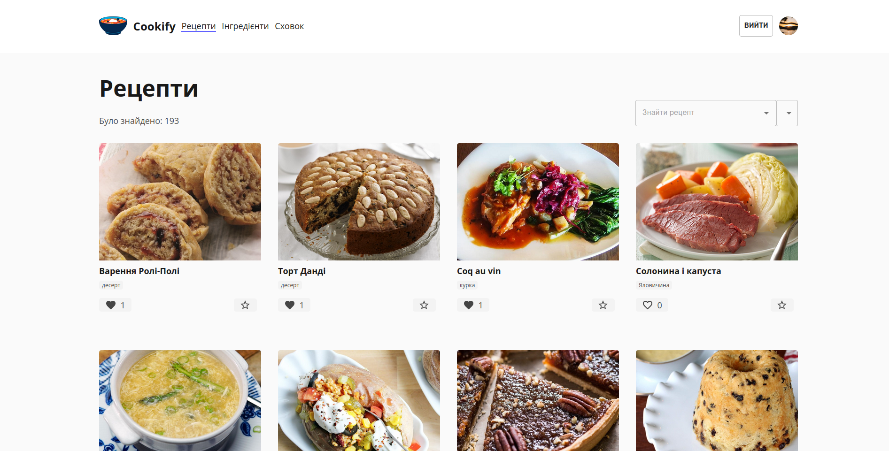

<!-- PROJECT LOGO -->
<br />
<div align="center">

<h1 align="center">Cookify</h1>

</div>


<!-- ABOUT THE PROJECT -->
## About The Project
Official website: https://example.com <br/>
BackEnd repository: [link](https://github.com/Danchikon/Cookify) <br/>
Cookify is a website where user can discover and create his own recipes.




<p align="right">(<a href="#readme-top">back to top</a>)</p>


### Built With
1. React
2. Redux
3. Typescript
4. Lodash
5. MUI
6. JSS

### Prerequisites

This is an example of how to list things you need to use the software and how to install them.
* npm
  ```sh
  npm install npm@latest -g
  ```

### Installation

1. Clone the repo
   ```sh
   git clone https://github.com/github_username/repo_name.git
   ```
2. Install NPM packages
   ```sh
   npm install
   ```


## Tasks

- [x] User can see ingredients for meal
- [x] User can see recipe for selected meal
- [x] User can create his own ingredients
- [x] User can filter his own ingredients
- [x] User can see recipes according to available ingredients

## Additional tasks
- [x] User can create his own recipes
- [ ] User can create his own recipes/ingredients group
- [ ] User can filter products by difficulty
- [ ] User can see the closest shops for each ingredient
